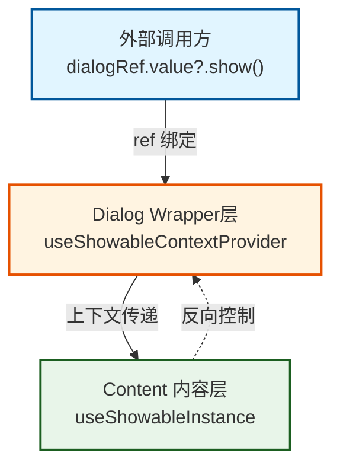

# Showable（可显示内容）

用于弹窗、抽屉等「可显示/隐藏」内容的共享状态与生命周期，基于 `createInjectionState`，在父级提供上下文后，子组件可获取同一套 `show/close`、`status` 等。

从 `hoci` 引入：

```ts
import {
  onShowableHide,
  onShowableShow,
  showableRef,
  useShowableContextProvider,
  useShowableInstance
} from "hoci";
```

## 快速开始

### 架构示意图



```vue
<script setup>
import {
  showableRef,
  useShowableContextProvider,
  useShowableInstance
} from "hoci";
import { defineComponent, h } from "vue";

// 1. 创建 showableRef 用于外部控制
const dialogRef = showableRef();

const Provider = defineComponent({
  setup() {
    // 使用 useShowableContextProvider 返回的 store
    const { visible, cancel } = useShowableContextProvider();

    // 获取 showable 实例，通过 ref 绑定挂载到组件上
    const instance = useShowableInstance();
    const { show, close, confirm } = instance;

    // 返回实例，Vue 会自动将其挂载到 ref 上
    return {
      show,
      close,
      confirm,
      render: () => h(Content)
    };
  }
});

// 2. 在子组件中使用
const Content = defineComponent({
  setup() {
    // 获取 showable 实例
    const instance = useShowableInstance();
    const {
      show, // 打开
      close, // 关闭
      confirm, // 确认（status = "ok"）
      reject, // 拒绝（status = "reject"）
      cancel, // 取消（status = "cancel"）
      visible, // 是否可见
      status // 当前状态
    } = instance;

    return () => h("div", { class: "flex flex-col gap-2" }, [
      h("div", { class: "flex gap-2" }, [
        h("button", { onClick: () => show() }, "打开"),
        h("button", { onClick: () => close() }, "关闭"),
        h("button", { onClick: confirm }, "确认"),
        h("button", { onClick: cancel }, "取消")
      ]),
      h("div", `visible: ${visible.value}, status: ${status.value}`)
    ]);
  }
});
</script>

<template>
  <div class="flex flex-col gap-2">
    <!-- 在 Provider 外部的作用域中调用，通过 ref 挂载 -->
    <button @click="dialogRef?.show()">
      外部触发
    </button>
    <Provider ref="dialogRef" />
  </div>
</template>
```

## 基本用法

在根组件（或包裹弹层的那一层）调用 `useShowableContextProvider()`，在需要控制显示的地方使用 `useShowableInstance()`。

<demo src="../examples/showable/basic.vue"/>

## 弹窗组件示例

一个完整的弹窗组件示例，展示如何使用 `useShowableInstance` 控制弹窗的显示/隐藏和状态。

<demo src="../examples/showable/dialog.vue"/>

## 带参数打开

调用 `instance.show(data)` 时传入参数，内部通过 `onShowableShow` 或 `useShowableInstance({ onShow })` 接收参数。

<demo src="../examples/showable/with-params.vue"/>

## API

### Provider

| 方法 | 说明 |
| --- | --- |
| `useShowableContextProvider()` | 在父组件调用一次，提供 showable 上下文。必须在子组件使用 `useShowableInstance` 之前调用。 |

### useShowableInstance(options?)

在已有 provider 的子树内调用，返回当前 showable 的实例 API 与响应式状态。

**返回值：**

| 属性 / 方法 | 类型 | 说明 |
| --- | --- | --- |
| `show(data?)` | `(data?: PARAMETERS) => void` | 打开（将 visible 设为 true，status 设为 "none"），可传入参数传递给事件监听器 |
| `close(status?)` | `(status?: ShowableStatus) => void` | 关闭并设置 status（默认 "none"） |
| `confirm()` | `() => void` | 关闭且 status 为 "ok"，同时触发 "confirm" 事件 |
| `reject()` | `() => void` | 关闭且 status 为 "reject"，同时触发 "reject" 事件 |
| `cancel()` | `() => void` | 关闭且 status 为 "cancel"，同时触发 "cancel" 事件 |
| `visible` | `ComputedRef<boolean>` | 是否显示 |
| `header` | `ComputedRef<string \| boolean>` | 标题 |
| `status` | `ComputedRef<ShowableStatus>` | 当前状态 |

**无 provider 时**：会抛出错误 `"useShowableContextStore must be used after useShowableContextProvider"`。

### UseShowableInstanceOption

| 属性 | 类型 | 说明 |
| --- | --- | --- |
| `onShow` | `(parameters?: PARAMETERS) => void \| Promise<void>` | 每次调用 `show()` 时触发，接收传入的参数。当 `REQUIRE` 为 `true` 时，参数为必填 |
| `onHide` | `(status: ShowableStatus) => void` | 每次调用 `close()` 时触发，接收关闭时的 status |
| `onConfirm` | `() => void` | status 变为 "ok" 时调用（通过 `confirm()`） |
| `onReject` | `() => void` | status 变为 "reject" 时调用（通过 `reject()`） |
| `onCancel` | `() => void` | status 变为 "cancel" 时调用（通过 `cancel()`） |
| `header` | `MaybeRefOrGetter<string \| false>` | 同步到 store 的标题，可以是字符串、`false`（隐藏）、或 ref/computed |

### onShowableShow / onShowableHide

| 方法 | 说明 |
| --- | --- |
| `onShowableShow(fn, options?)` | 注册回调，当调用 `show()` 时触发。回调接收 `show()` 传入的参数。`options.immediate`（默认 `true`）控制是否立即调用（如果 showable 已可见）。**注意**：当回调的参数类型为必填时，`immediate` 选项不可用（类型层面禁止） |
| `onShowableHide(fn)` | 注册回调，当调用 `close()` 时触发。回调接收关闭时的 status |

### showableRef()

返回 `shallowRef<Showable<T> | null>(null)`，用于在外部持有「可显示实例」的引用（例如通过模板 ref 拿到子组件暴露的 `show` 方法）。

### 类型

| 类型 | 说明 |
| --- | --- |
| `ShowableStatus` | `"none" \| "ok" \| "cancel" \| "reject"` - 关闭时的状态 |
| `ShowableInstance<PARAMETERS, REQUIRE?>` | `useShowableInstance` 的返回类型（含 `show/close/confirm/reject/cancel` 与响应式状态） |
| `Showable<PARAMETERS, REQUIRE?>` | 仅含 `show(data?)` 的接口，用于 `showableRef` 等。当 `REQUIRE` 为 `true` 时，`show()` 参数必填 |
| `ShowableResult<T>` | 结果对象形态（含 id、status、data 等，可按需扩展） |
